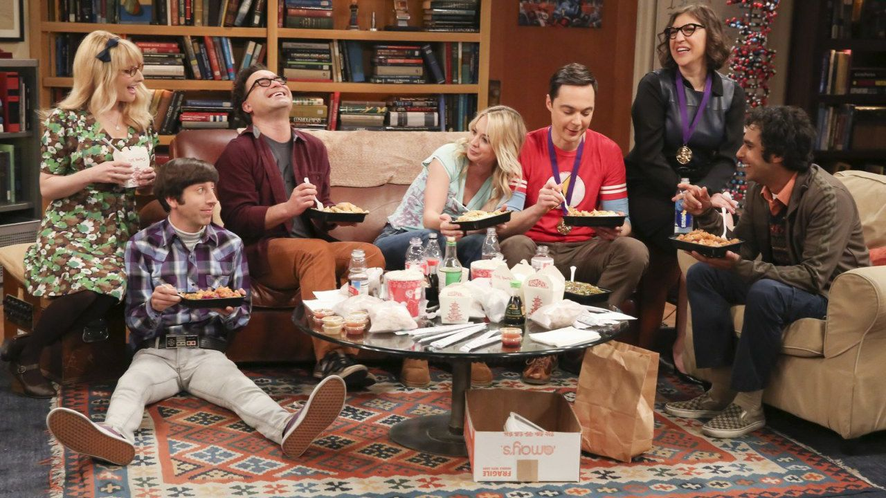
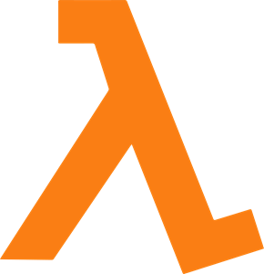
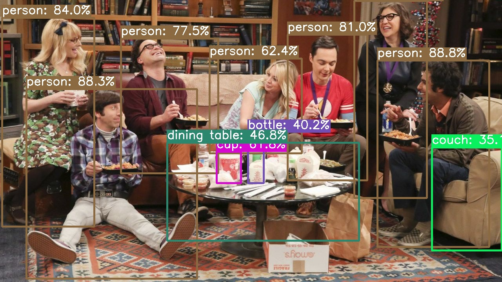

# YOLambda: Scaling YOLOv8 inference with Serverless

## Overview

Learn how to run inference at scale with [YOLOv8](https://github.com/ultralytics/ultralytics) in a secure and reliable way with [AWS Lambda](https://aws.amazon.com/lambda/) and [AWS SAM](https://aws.amazon.com/serverless/sam/).

<p>
	
	>>>
	
	>>>
	
</p>

## Instructions

0. Install dependencies

	```bash
	# Create a new environment and activate it
	conda env create -f environment.yml
	conda activate yolambda

	# Install dependencies
	pip install -qr requirements.txt
	```

1. Convert YOLOv8 model to ONNX

	```bash
	# Export PT -> ONNX
	yolo mode=export model=yolov8n.pt format=onnx dynamic=True

	# (Optional) Simplify
	# https://github.com/daquexian/onnx-simplifier
	onnxsim yolov8n.onnx yolov8n.onnx

	# (Optional) Optimize
	# https://github.com/onnx/optimizer
	python -m onnxoptimizer yolov8n.onnx yolov8n.onnx

	# (Optional) Visualize

	# 🌐 Browser
	# Visit https://netron.app/

	# 💻 CLI
	# https://github.com/lutzroeder/netron
	netron -b yolov8n.onnx

	# Move it to the models folder
	mkdir models; mv yolov8n.onnx $_
	```

2. Build and deploy the application

	```bash
	# 🏗️ Build
	sam build --use-container

	# 🚀 Deploy
	sam deploy --guided

	# ❗ Don't forget to note down the function URL
	export YOLAMBDA_URL=$(sam list stack-outputs --stack-name yolambda --output json | jq -r .[0].OutputValue)
	```

4. Test the application

	**Development:**

	Using [sam local](https://docs.aws.amazon.com/serverless-application-model/latest/developerguide/using-sam-cli-local.html)

	```bash
	# Create event
	echo {\"body\": \"{\\\"image\\\": \\\"$(base64 images/example.jpg)\\\"}\"} > test/event.json

	# Invoke function
	sam local invoke --event test/event.json
	```

	**Production:**

	Using [awscurl](https://github.com/okigan/awscurl.git)

	<!--
	Note: learned a lot by checking the `aws_curl.make_request` implementation
	https://github.com/okigan/awscurl/blob/master/awscurl/awscurl.py
	-->

	```bash
	# Create payload
	echo {\"image\": \"$(base64 images/example.jpg)\"} > test/payload.json

	# Make request
	awscurl --service lambda -X GET -d @test/payload.json $YOLAMBDA_URL

	# Pro tip: pretty-print the output by piping it to jq
	```

	or a custom Python script

	```bash
	python test/test.py $YOLAMBDA_URL images/example.jpg
	```

<!--
## TODO

* Build a Streamlit application around this

* Run Lambda functions on the AWS IoT Greengrass core (v1? v2?)
https://aws.amazon.com/blogs/aws/aws-greengrass-run-aws-lambda-functions-on-connected-devices/
https://docs.aws.amazon.com/greengrass/v1/developerguide/lambda-functions.html
https://docs.aws.amazon.com/greengrass/v2/developerguide/greengrass-v1-concept-differences.html

	Issues with the GG service role:
	> GreenGrass is not authorized to assume the Service Role
	https://repost.aws/questions/QUrO84DbX-QLe8I2fiLKEshg/greengrass-is-not-authorized-to-assume-the-service-role
	https://docs.aws.amazon.com/greengrass/v1/developerguide/security_iam_troubleshoot.html
	https://docs.aws.amazon.com/greengrass/v1/developerguide/service-role.html

	NMCLI to manage wifi connection
	https://www.makeuseof.com/connect-to-wifi-with-nmcli/

* Test with Serverless
https://www.serverless.com/framework/docs/providers/aws/guide/functions
-->
